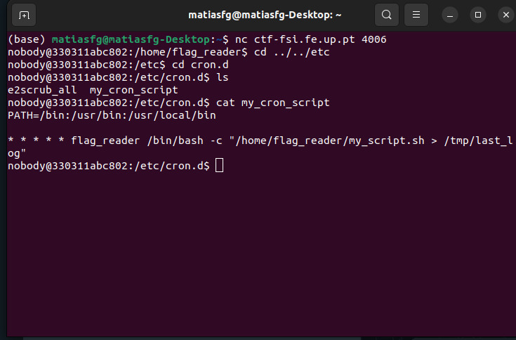
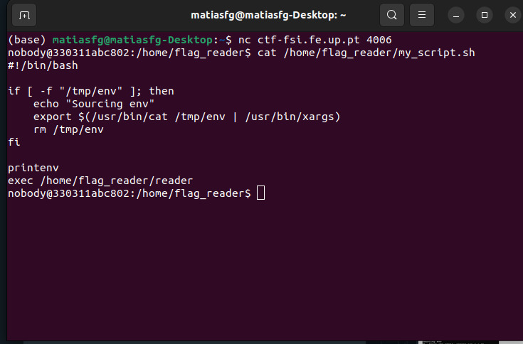
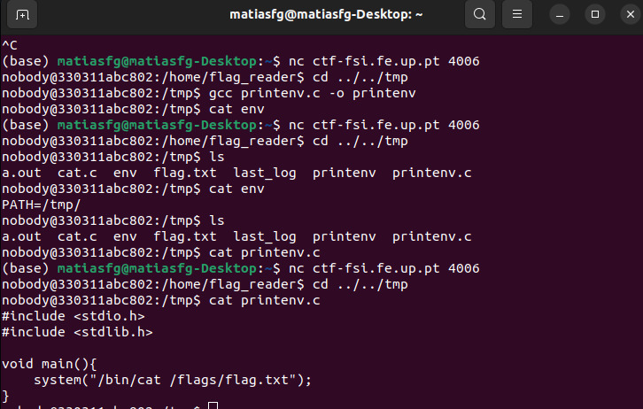
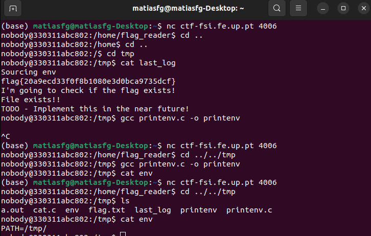

# CTF Extras

## CTF - British Punctuality

Após analise de cronjobs, que viemos a descobrir que é uma fonte de vulnerabilidades, e tendo em conta o nome do CTF, podemos concluir que teriamos de aceder ao cron. Tratamos então de aceder ao cron.d , dentro descobrimos um ficheiro com o nome de my_cron_script.sh que está a ser executado com permissão flag_reader. Esse ficheiro está a imprimir os seus resultados do diretorio **/home/flag_reader/my_script.sh** em **/tmp/last_log**. Abrindo o conteudo do ficheiro my_script.sh podemos verificar a existencia de de um ficheiro **/tmp/env** através de **-f flag**. 
Após esta analise verificamos que o melhor procedimento seria manipular o printenv binario, assim que um diretorio completo não fosse atribuido. Para isso, é necessário mudar a pesquisa do binário, mudando o diretório da variavel ambiente para **/tmp** que é o unico documento que temos permissões para editar. Nesse diretorio, criamos um programa em C que imprimia conteudo dentro de /flag/flags.txt.
Finalmente, ao visualizar o conteudo de last_log, podemos visualizar então a nossa flag.

