# Seed Labs - Cross Site Scripting

Trabalho Realizado na semana 10 e 11.

## Lab Setup

Incialmente, utilizamos o comando gedit admin:///etc/hosts para podermos editar o ficheiro com os dados que foram dados

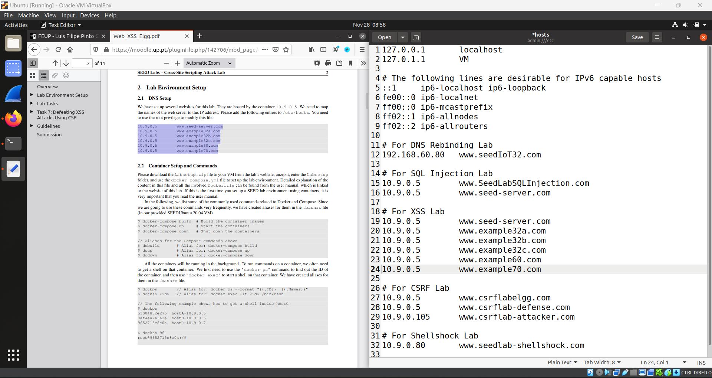

E corremos o dcbuild e dcups.

## Task 1: Posting a Malicious Message to Display an Alert Window

O objetivo desta tarefa foi incorporar um programa javasript que será executado quando a página for carregada e exibirá um pop up com 'XSS'.
Para isso , fizemos login com a Alice, e editamo seu perfil com o seguinte comando.

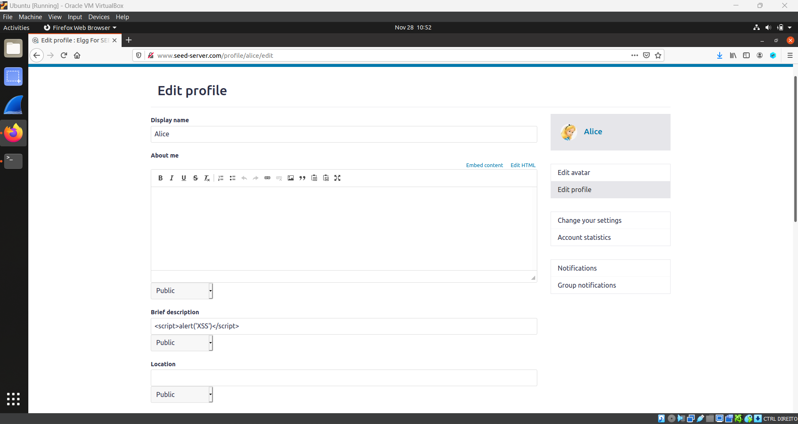

e o Pop Up aconteceu.

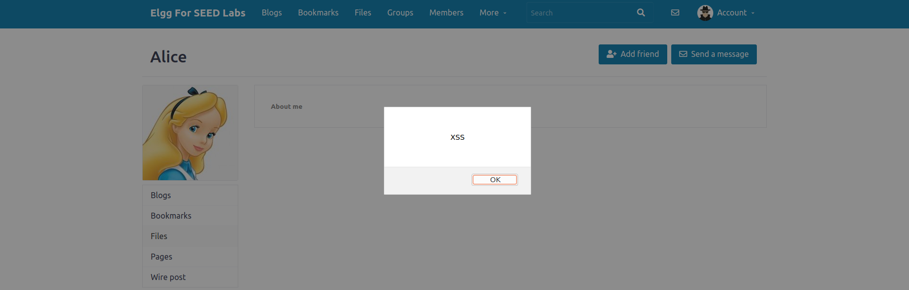

## Task 2: Posting a Malicious Message to Display Cookies

Basicamente a tarefa 2 era a mesma da primeira mas desta vez a imprimir o cookie do user.

Para isso, em vez do alert('XSS') , metemos alert('document.cookie') e ...

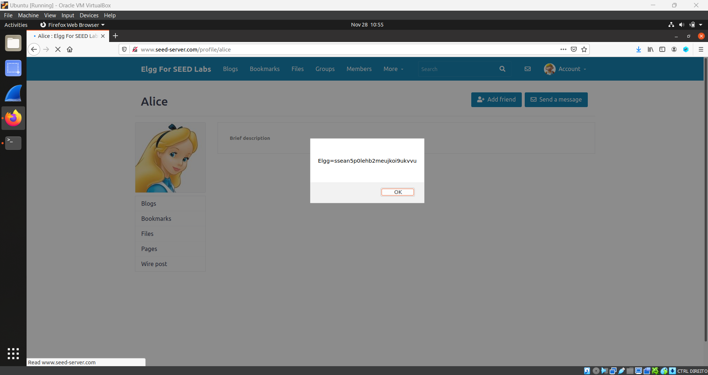

## Task 3: Stealing Cookies from the Victim's Machine
Nesta tarefa o objetivo é roubar os cookies de algum vistitante, neste caso na pagina da Alice.

Para isso substituimos o alert por :
document.write('');

O '10.9.0.1' é o endereço IP da máquina enquanto '5555' corresponde ao local da porta onde o script enviará um HTTP GET para a máquina.

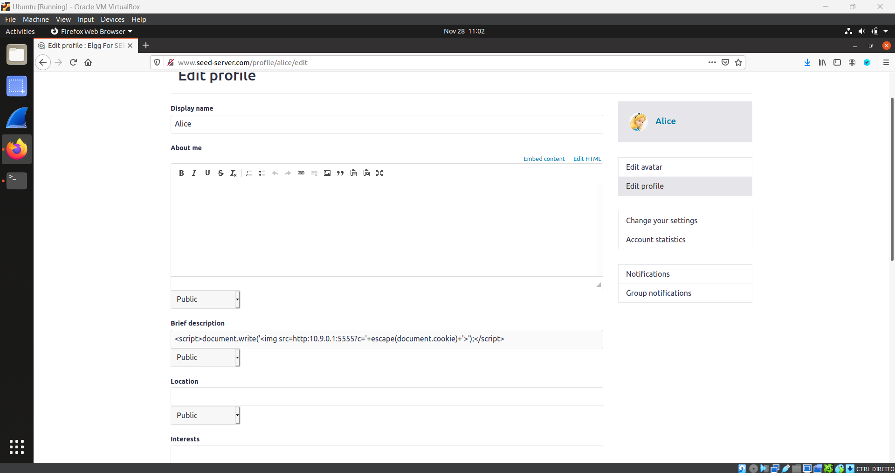

Corremos então o seguinte comando 'nc -lknv 5555' , no terminal, o que nos permitirá ver o que somos capazes de roubar.
E o resultado foi....

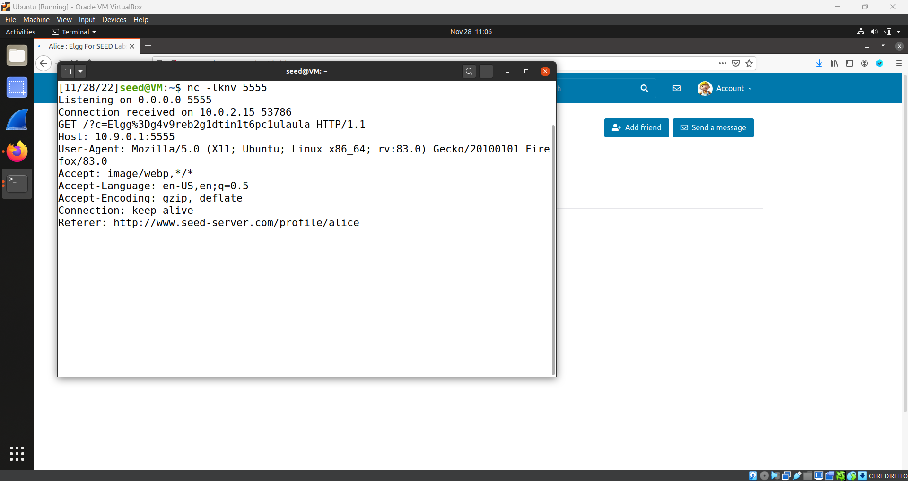

## Task 4: Becoming the Victim’s Friend
Nesta tarefa simulamos uma requisição HTML com JS.

Para isso, editamos no About Me, com o perfil do Samy, EDIT HTML:
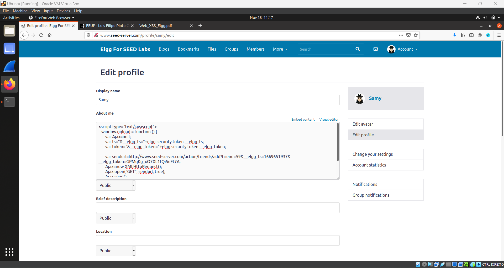

Obtivemos o url necessário através de uma inspeção de pagina, 
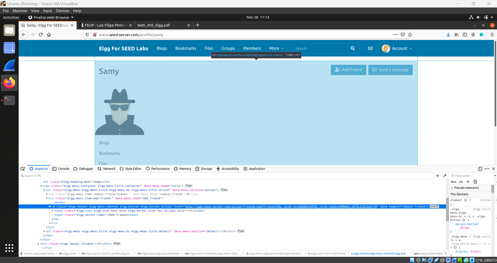

e quando voltamos á pagina do Samy ...
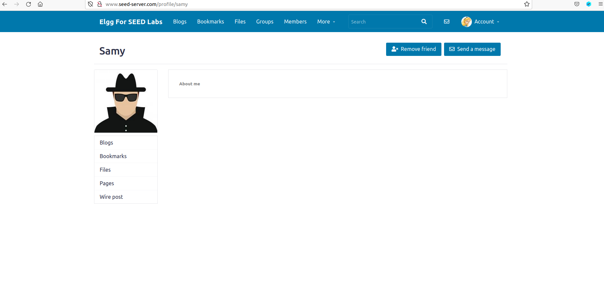

# Desafios CTF

## CTF 1

No primeiro desafio tínhamos um servidor web em ctf-fsi.fe.up.pt:5002, onde podíamos enviar pedidos ao admin a pedir a flag.
Como conseguimos incorporar um javasript, tentamos usá-lo.

Usando o script a seguir, conseguimos obter a bandeira para o primeiro desafio:

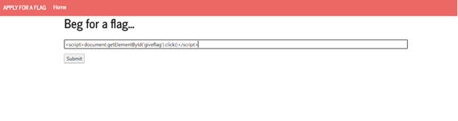

A flag demorou a aparecer, mas o que esse código faz é pegar o html com o id "giveflag" e clicar nele.
A explicação é que o elemento ao clicar tinha uma função que nos dava a flag.
Aqui está a bandeira:

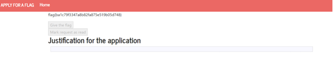

## CTF 2

Uma das features que tinhamos acessos era a de testar o ping para determinado endereço web. Tal comando era feito usando uma chamada ao sistema linux. Apos alguns testes, descobrimos como podiamos usar isso a nosso favor.

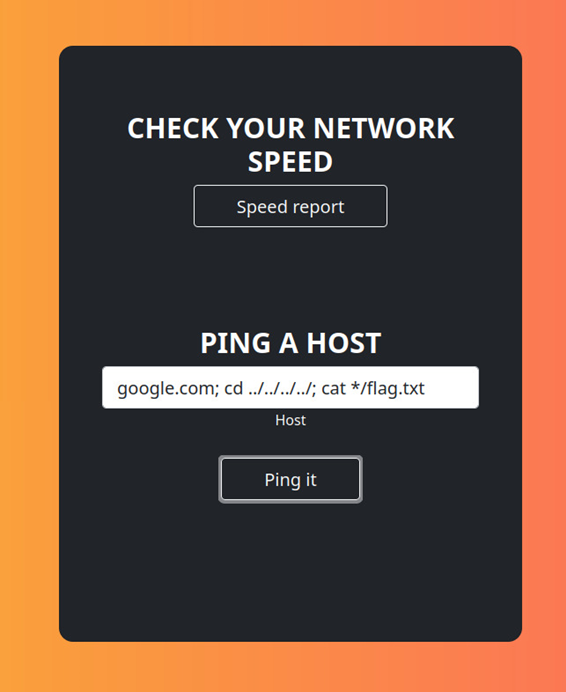

Primeiro começamos a usar ls –a para ver todos os arquivos na pagina. Ao nao ser encontrado nada parecido com a flag, decidimos usar cd para a troca de pasta. E utilizamos o cat para vermos o conteudo de qualquer ficheiro onde o nome fosse flag.txt

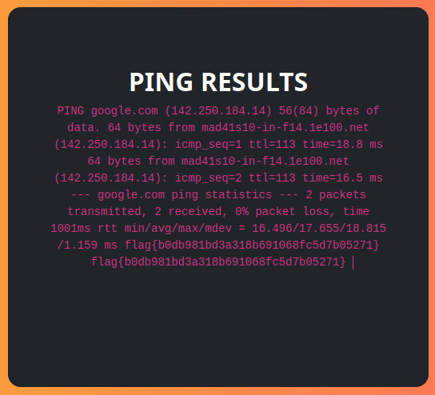
