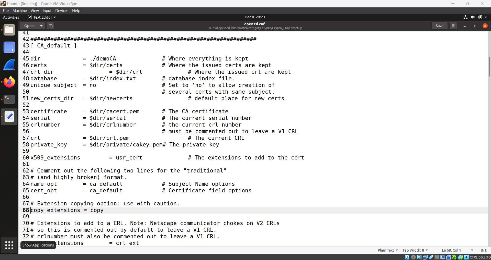

# Public-Key Infrastructure (PKI) Lab

**Tarefas para as semana #12 e #13**

Inicialmente, corremos o comando: gedit admin:///etc/hosts para acrescentar ao ficheiro os seguintes dados:

>10.9.0.80 www.bank32.com
>10.9.0.80 www.smith2020.com

## Task 1: Becoming a Certificate Authority (CA)

Primeiramente, fomos á localização do arquivo de configuração na pasta que queríamos. Para isso utilizamos o comando:

>cp /usr/lib/ssl/openssl.cnf .

Nesta tarefa tivemos que criar uma Certificate Authority (CA), que é uma autoridade confiável que cria e assina certificados digitais.

Para criar um certificado CA, usamos o seguinte comando:

>openssl req -x509 -newkey rsa:4096 -sha256 -days 3650 \
-keyout ca.key -out ca.crt \
-subj "/CN=www.modelCA.com/O=Model CA LTD./C=US" \
-passout pass:dees


_Note:_ O ficheiro "ca.key" contém a chave privada do CA e o ficheiro "ca.crt" contém a chave pública.

Em seguida, utilizamos os seguintes comandos:
>openssl x509 -in ca.crt -text -noout

>openssl rsa -in ca.key -text -noout


É nos pedido que respondemos á seguintes questões:

- **What part of the certificate indicates this is a CA’s certificate?**
Na secção "basic constraints" existe um atributo "certificate aithority" e conseguimos presenciar que o seu estado é "Yes", logo mostra nos que é o certeficado para CA


- **What part of the certificate indicates this is a self-signed certificate?**
Este é um self-signed certificate  porque no ficheiro podemos ver que o assunto e o emissor são os mesmos. 
Além disso, no comando que executamos foi incluído a flag "-x509" , utilizado na criação de self-signed certificates.


- **In the RSA algorithm, we have a public exponent e, a private exponent d, a modulus n, and two secret
numbers p and q, such that n = pq. Please identify the values for these elements in your certificate
and key files.**

n é "modulus" , p e q são prime1 e prime 2, respetivamente


## Task 2: Generating a Certificate Request for Your Web Server

Nesta tarefa, o objetivo é criar uma "Certificate Signing Request", CSR.

Inicilamente, executamos o seguinte comando:
>openssl req -newkey rsa:2048 -sha256 \
-keyout server.key -out server.csr \
-subj "/CN=www.bank32.com/O=Bank32 Inc./C=US" \
-passout pass:dees

Após alguma pesquisa, achamos melhor fazer agumas alterações ao comando anterior, de forma a que o certificado permita nomes alternativos:
>openssl req -newkey rsa:2048 -sha256 -keyout server.key -out server.csr -subj "/CN=www.bank32.com/O=Bank32 Inc./C=US" -passout pass:dees -addext "subjectAltName = DNS:www.bank32.com, DNS:www.bank32A.com, DNS:www.bank32B.com"


Em seguida, de forma a visualizar a informação, corremos os seguintes comandos:
> openssl req -in server.csr -text -noout
> openssl rsa -in server.key -text -noout


## Task 3: Generating a Certificate for your server

Nesta tarefa, o objetivo é criar um certificado para o nosso servidor.

Primeiramente, demos uncomment á extensão pedida.



E de seguida, corremos o seguinte comando:
>openssl ca -config myCA_openssl.cnf -policy policy_anything -md sha256 -days 3650 -in server.csr -out server.crt -batch -cert ca.crt -keyfile ca.key

Este comando permite converter o "server.csr" em um certicated, self-signed certificate "server.crt".


## Task 4: Deploying Certificate in an Apache-Based HTTPS Website

O objetivo desta tarefa é configurarmos um website HTTPS em Apache usando o certificado gerado nas tarefas anteriores para proteger a nossa navegação.

Primeiro movemos os ficheiros gerados na tarefa anterior (server.crt e server.key) para a pasta /certs do container.
```
[20/12/22]seed@VM:~/.../image_www$ tree
.
├── bank32_apache_ssl.conf
├── certs
│   ├── bank32.crt
│   ├── bank32.key
│   ├── modelCA.crt
│   ├── README.txt
│   ├── server.crt
│   ├── server.csr
│   └── server.key
├── Dockerfile
├── index.html
├── index_red.html
└── bank32_apache_ssl.conf.
```

E como podemos visualizar, o servidor Apache sabe o diretório onde estão armazenados os arquivos do site através de sua entrada VirtualHost, localizada no ficheiro bank32_apache_ssl.conf:

```
[20/12/22]seed@VM:~/.../image_www$ cat bank32_apache_ssl.conf
<VirtualHost *:443>
	DocumentRoot /var/www/bank32
	ServerName www.bank32.com
	ServerAlias www.bank32A.com
	ServerAlias www.bank32B.com
	DirectoryIndex index.html
	SSLEngine On
	SSLCertificateFile /certs/bank32.crt ➀
	SSLCertificateKeyFile /certs/bank32.key ➁
</VirtualHost>

<VirtualHost *:80>
    DocumentRoot /var/www/bank32
    ServerName www.bank32.com
    DirectoryIndex index_red.html
</VirtualHost>

# Set the following gloal entry to suppress an annoying warning message
ServerName localhost
```

De seguida, inciamos os containers docker e o servidor apache com o seguinte comando:
>service apache2 start

E o resultado:


## Task 5: Task 5: Launching a Man-In-The-Middle Attack

Para esta tarefa vamos simular um ataque MITM (Man In The Middle). 

Primeiramente, escolhemos nosso website de destino, que será (http://www.example.com) e para isso precisamos de alterar o nosso ficheiro de configuração do servidor para hospedar nosso site nesse URL:

```
[20/12/22]seed@VM:~/.../image_www$ cat bank32_apache_ssl.conf
<VirtualHost *:443>
    DocumentRoot /var/www/bank32
    ServerName www.example.com
    ServerAlias www.exampleA.com
    ServerAlias www.exampleB.com
    DirectoryIndex index.html
    SSLEngine On
    SSLCertificateFile /certs/server.crt
    SSLCertificateKeyFile /certs/server.key
</VirtualHost>

<VirtualHost *:80>
    DocumentRoot /var/www/bank32
    ServerName www.example.com
    DirectoryIndex index_red.html
</VirtualHost>

# Set the following gloal entry to suppress an annoying warning message
ServerName localhost
```

Em seguida, corremos o comando: gedit admin:///etc/hosts para acrescentar ao ficheiro:
> 10.9.0.80 www.example.com

E o resultado:


Não podemos aceder ao website, o que prova que o ataque MITM é derrotado pelo uso da infraestrutura PKI.
Isto acontece porque o nomes não coincidem, o que só aconteceria se o servidor tivesse um certificado CA válido para ele.


## Task 6: Launching a Man-In-The-Middle Attack with a Compromised CA

Nesta tarefa, precisamos de refazer os passos das tarefas anteriores, a fim de ter um certificado válido para example.com e o navegador não alertar o user sobre qualquer problema de segurança.

Então, para isso, criamos uma solicitação de certificado para nosso novo website:

>openssl req -newkey rsa:2048 -sha256 \
>-keyout server.key -out server.csr \
>-subj "/CN=www.example.com/O=BANK32/C=PT" \
>-passout pass:dees \
>-addext "subjectAltName = DNS:www.example.com, \
>DNS:www.exampleA.com, \
>DNS:www.exampleB.com"

E com a nossa root CA, forneçemos um certificado para essa solicitação:

openssl ca -config myCA_openssl.cnf -policy policy_anything \
-md sha256 -days 3650 \
-in server.csr -out server.crt -batch \
-cert ca.crt -keyfile ca.key

E o resultado:


# Desafios CTF

## Desafio 1

Correndo o seguinte codigo, conseguimos descobrir a flag:
```
from binascii import hexlify, unhexlify
from sympy import nextprime
from sympy import mod_inverse
p = nextprime(2*512, ith=1) # next prime 2*512
q = nextprime(2*513, ith=1) # next prime 2*513
n = p*q
e = 0x10001 # a constant
d = mod_inverse(e,(p-1)*(q-1)) # a number such that d*e % ((p-1)*(q-1)) = 1
enc_flag = b'0000000000000000000000000000000000000000000000000000000000000000000000000000000000000000000000000000000000000000000000000000000000000000000000000000000000000000000000000000000000000000000000000000000000000000000000000000000000000000000000000000000000000001a5f2f016ed84e465b61538dbbfa91966810d8398acffc38a3aeaabe07d275d4bd209af6bbb32b88d824c81fa6e822bc71924c057bf92e9cd0553fa5db2f305872e8dee71dc0f4c399a4e5de275fe5dd5a973459aa5e37bcc2c3b6e0b211fdb20be9732570724977490d650cad5e24db37543e3532f4132aaeaf30105b3cfd679'
 #""

def enc(x):
	int_x = int.from_bytes(x, "big")
	y = pow(int_x,e,n)
	return hexlify(y.to_bytes(256, 'big'))

def dec(y):
	int_y = int.from_bytes(unhexlify(y), "big")
	x = pow(int_y,d,n)
	return x.to_bytes(256, 'big')

y = dec(enc_flag)
print(y.decode())
```


## Desafio 2

Correndo o seguinte codigo, conseguimos descobrir a flag:

```
from binascii import hexlify, unhexlify

n = 29802384007335836114060790946940172263849688074203847205679161119246740969024691447256543750864846273960708438254311566283952628484424015493681621963467820718118574987867439608763479491101507201581057223558989005313208698460317488564288291082719699829753178633499407801126495589784600255076069467634364857018709745459288982060955372620312140134052685549203294828798700414465539743217609556452039466944664983781342587551185679334642222972770876019643835909446132146455764152958176465019970075319062952372134839912555603753959250424342115581031979523075376134933803222122260987279941806379954414425556495125737356327411
e1 = 0x10001
e2 = 0x10003
m1 = 0x4f1a8fb6e1869230b6bd478e2960349b10f1f8f15959048dbfff23a724a58f5842bf542bce63182f031c552e10921c56f8bd08c89aeb05199201b2136573820b24eba6806cb6fc1c86943448077b56a438b26900f534a2d58046bc4da2a0620d384ce8aaa0aa4d704ff981491022b13f9489f85b071bd2e0f147927e5fd9d158876442a756e99461f88dd3c59754f7d58476759060baa2210c38bc227febdaf1b8a983c35a228f647a8a61b08ee63fbde55957d276b09f65d2f3f277ecbd7f31d50cb111edfd638399d91a8f33b08266fa73a0a32af87162489082a54b06f052a51acd8c5e06b6545c38ba7b1f80090c912ae64c98fcd795c095c999c9157d89
m2 = 0x7ac52fcdff363e47e5d71f45114adea5b963016bc2580bcec16714ce7bef51fc854d7487be9790782b5c1ff1178e919cd64045e202d8b7d228717fe27437d9de9996903f9d4c4bbe547549b1701ca0065e349b46a9f76a22d97bb6eaf5fb15e9776a2b456b8937900ca4bbd37d0191f4702344bda85f9cee6c8b036ee3520c3d1c28320d215992717474e0cf101ff0daf58ed88733afe51e5bbbb7e2ef548acfe58d6c08085f65055a9966ffb0c8797c386b20a071689df583cf63a55531278e69c438955cce223ec351fe4c7a352d665476a23caeb1be98be6f3c23ee19f03b64fa70b284444391bd5a4f398c612ed06d354c38ae26a6a0967cf98392c6b4cc
def gcdExtended(a, b):
 
    if a == 0:
        return b, 0, 1
 
    gcd, x1, y1 = gcdExtended(b % a, a)
 
    x = y1 - (b//a) * x1
    y = x1
 
    return gcd, x, y
```


