# SEED Labs - Buffer Overflow Setuid Lab

## Task 1: Getting Familiar with Shellcode

- Ao executar o código, podemos verificar que a shell contém arquivos de 32 e 64 bits (os arquivos a32.out e a64.out). Isso ocorre porque nosso sistema é de 64 bits, mas também possui compatibilidade com comandos de 32 bits.
- O código copia o shellcode para a pilha (char code[500]).

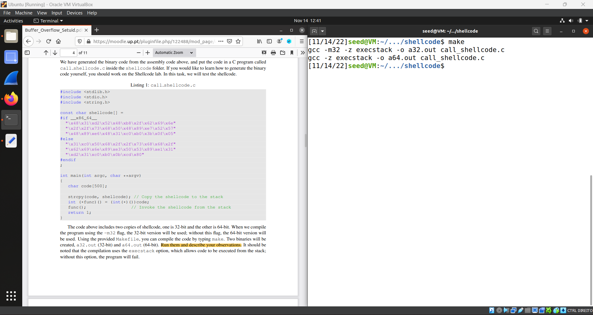

## Task 2: Understanding the Vulnerable Program

- Esta tarefa preparou-nos para a tarefa 3. 
- Primeiramente tivemos que desligar algumas proteções do Linux, em seguida tivemos que dar à root propriedade do ficheiro stack.c e dar ao user atual capacidade de chamar esse programa com permissões de root.

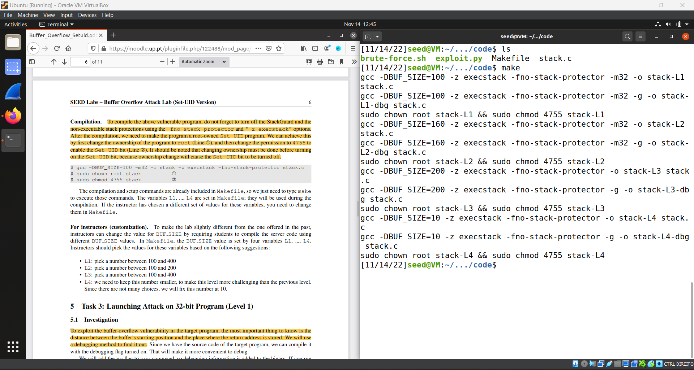

## Task 3: Launching Attack on 32-bit Program

Primeiramente criamos um dummy badfile para descobrir informaçoes sobre o Stack-L1. Depois abrimos um debug file (stack-L1-dgb) para juntar as informações que precisavamos.

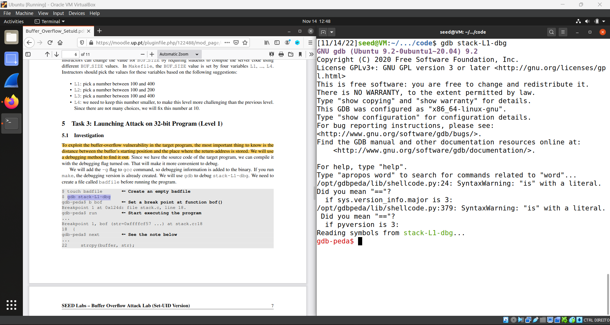

Depois corremos os comandos dados para juntar informações ("b bof","run","next","p $ebp","p $buffer")
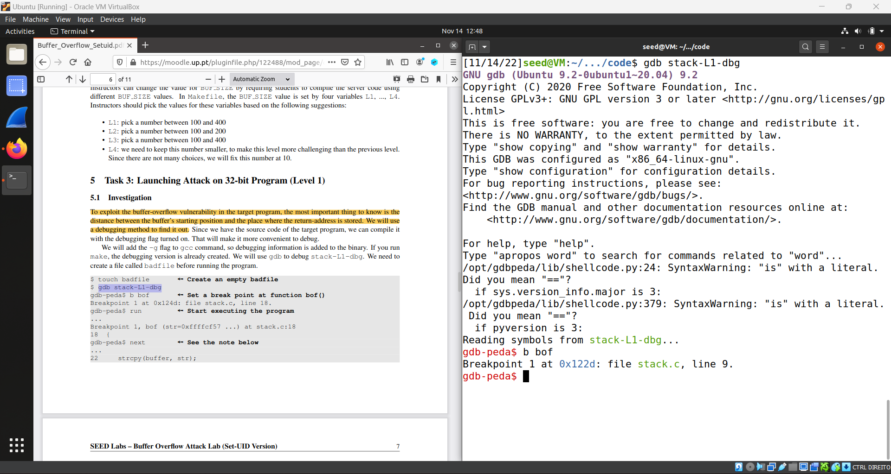
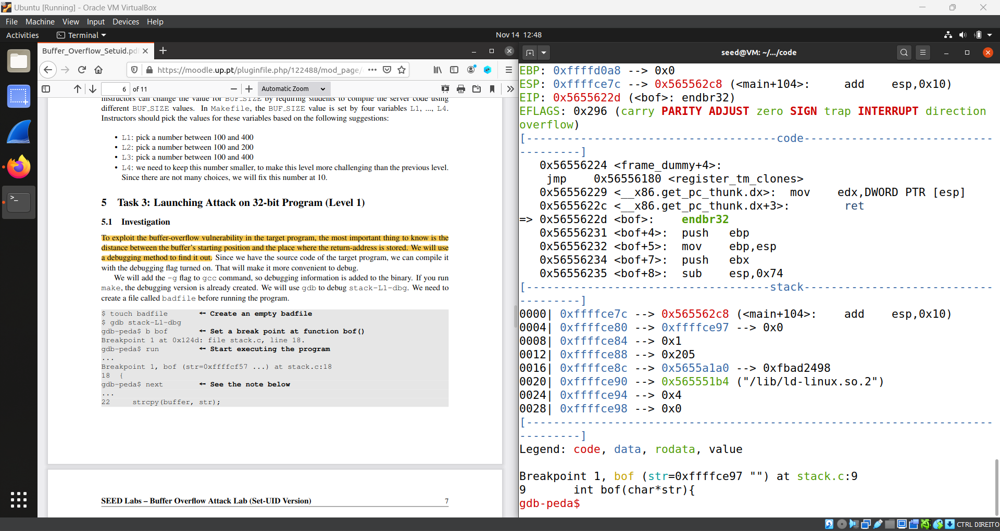
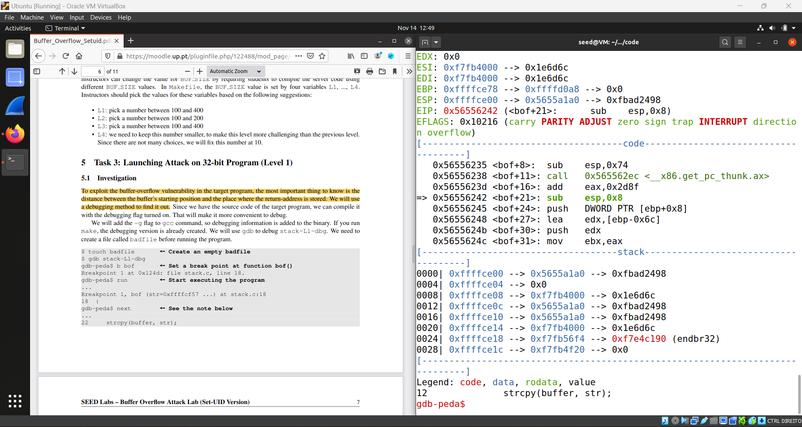
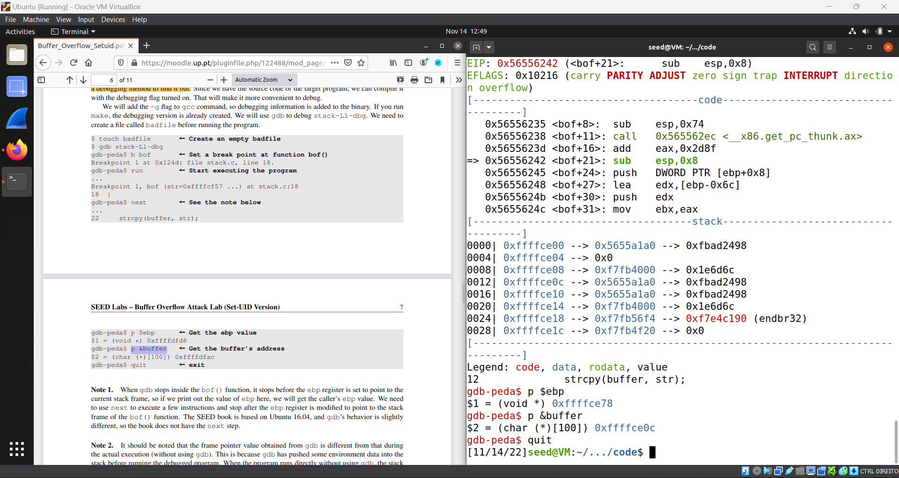

Com esses comandos, conseguimos descobrir o ebp adress (0xffffce78) e o adress do inicio do buffer (0xffffce0c)

Abrimos o ficheiro exploit.py e mudificamos os valores:

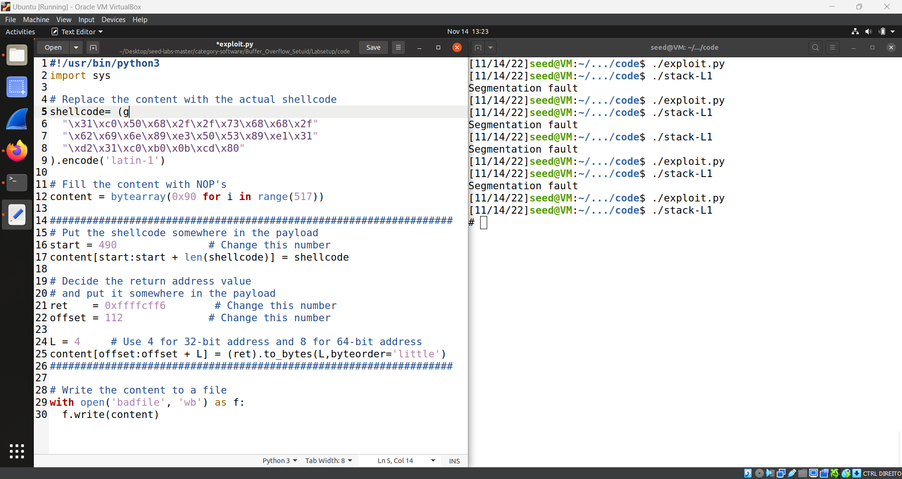

As informações que alteramos e como as obtivemos/calculamos são:

- start: Mudamos essa informação para "490", o motivo desse número é porque o buffer tem tamanho 517 e nosso shellcode tem tamanho 27bytes, e decidimos colocar nosso shellcode no final do buffer, e 517 -27=490.

- ret: Sabemos que o buffer começa em 0xffffce0c. Colocamos no nosso shellcode 27bytes antes do final, então em 0xffffce0c + 490 (em decimal)= 0xffffcff6 (endereço de retorno)

- offset: É aqui que precisamos injetar nosso endereço de retorno que aponta para nosso shellcode. Agora que o retorno que queremos alterar é depois do ebp, também sabemos que o ebp tem um tamanho de 4 bytes. Se 0xffffce78 (endereço ebp) - 0xffffce0c (endereço do buffer), obtemos que o ebp começa em 108 bytes. Então somamos o tamanho do ebd (os 4 bytes) e obtemos 112.

Em seguida, compilamos o nosso exploit e corremos o ficheiro, o que nos garantiu acesso á rootshell

# Desafios CTF

## Desafio 1
Como o código main.c foi fornecido, começamos por examiná-lo e tentar encontrar uma maneira de explorá-lo.
Pudemos ver que o nosso BUFFER tinha um tamanho de 20 bytes, porém o scanf estava a ler 28 bytes.
Podemos sobrescrever o ficheiro meme_file porque convenientemente ele tem 8 bytes e está localizado no lugar certo (ver a imagem abaixo).

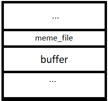

Editamos e executamos o exploit-example.py fornecido para escrever 28 bytes, os últimos 8 sendo "flag.txt" (o que queríamos que meme_file fosse).

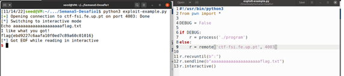

## Desafio 2
Mais uma vez, começamos por analisar o main.c fornecido.
A diferença do primeiro desafio para este é que agora temos o BUFFER, val e meme_file, em que val é uma nova condição e deve ser 0xFEFC2223.
Editamos nosso exploit-example.py para aceder a ctf-fsi.fe.up.pt:4000 e a string a ser enviada, adicionando o número que precisamos enviar antes de "flag.txt".
Executando:

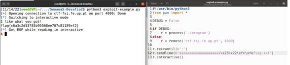
