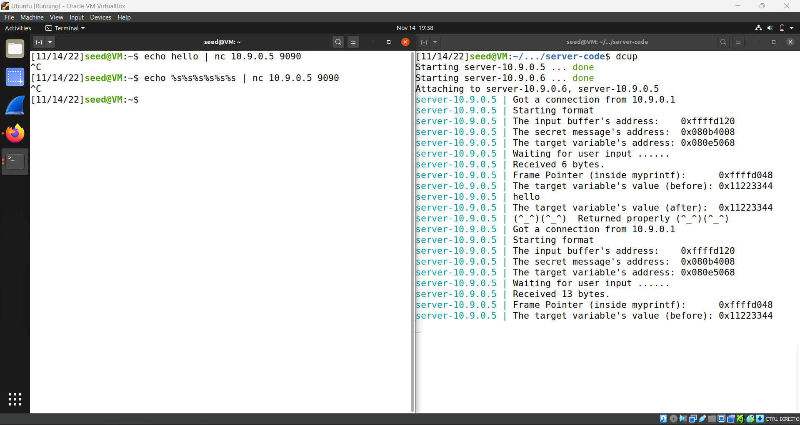
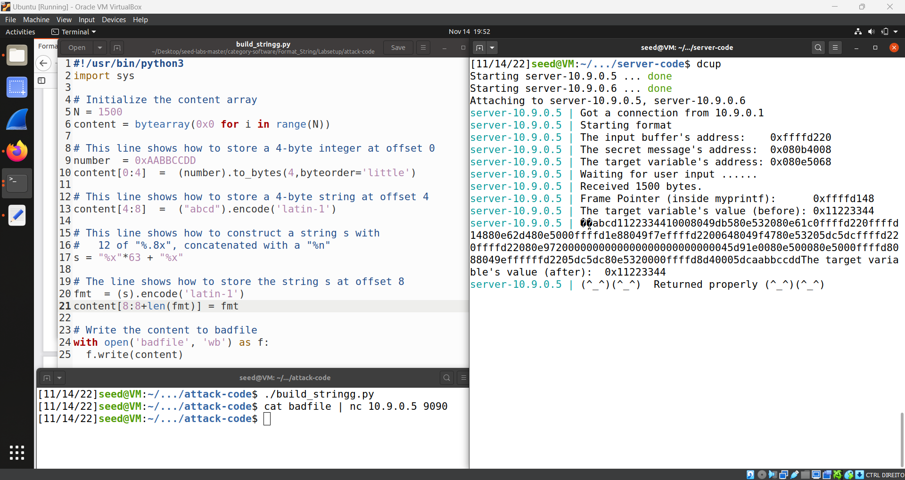
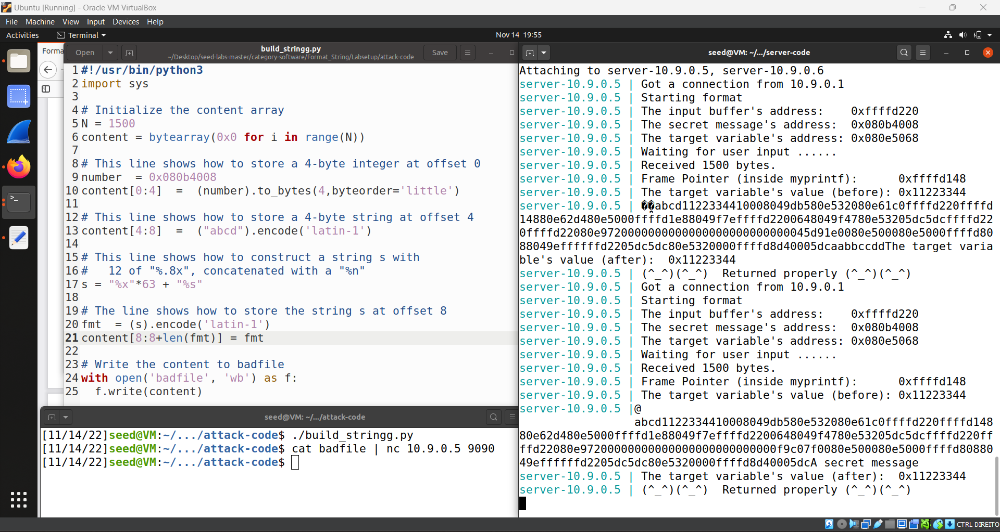
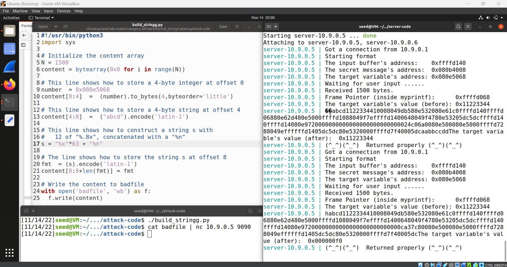
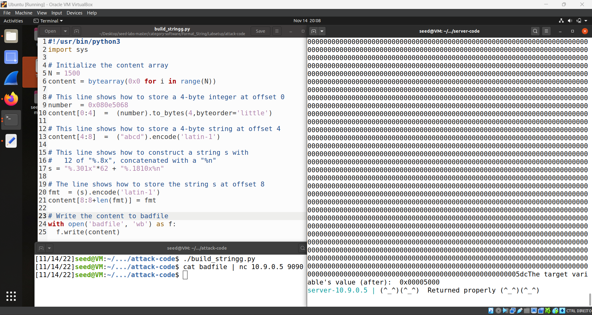
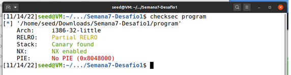
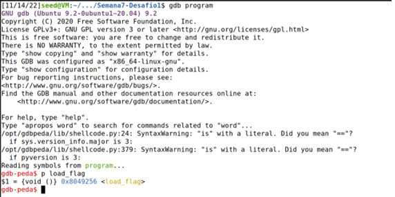
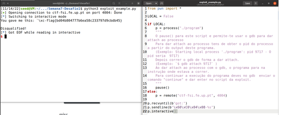
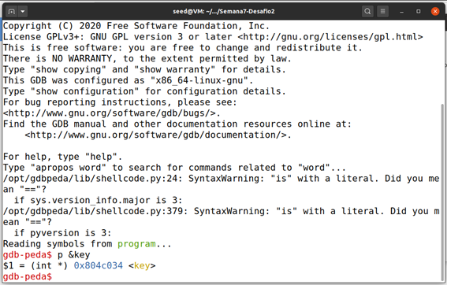
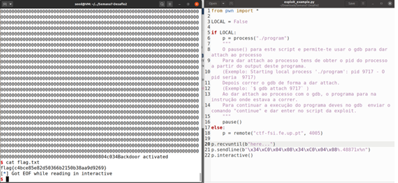

# Seed Labs - Format Strings
Trabalho Realizado na semana 8

- Primeiramente, abrimos o server e verificamos se está tudo bem e funcional. Quando o servidor estive pronto, executamos o seguinte comando :
 echo hello | nc 10.9.0.5 9090
 Se o servidor estiver a recorrer propriamnete, receberemos um retorno apropriado.

## Task 1: Crashing the Program

- Para a Tarefa 1 temos de explorar um exploit para o printf() e o format strings. Para isso, iremos adicionar "%n" na nossa string , assim quando printf() executa e tenta imprimir a string , fará com que o pograma crash.

## Task 2: Printing out the Server Program's Memory
A)
O objetivo da tarefa 2a é ler os primeiros 4 bytes de nossa string. 
- Para isso mudifiamos a nossa string para ter os 4 bytes que queremos ler no início , para isso foi escolhida 0xAABBCCDD . Depois disso, escrevemos “%x” quantas vezes forem necessárias, por tentativa-erro, até chegarmos ao início da nossa string, onde o conteúdo da nossa string é lido pelo printf().

B)
O objetivo da tarefa 2b é ler a mensagem secreta armazenada na área de heap.

- Primeiro, escrevemos o endereço da mensagem secreta , 0x080b4008 facultado pelo servidor, no início de nossa string.

- Segundo, sabemos que para aceder ao início da nossa string devemos utilizar “%x” 64 vezes, porém como desta vez queremos ler o conteúdo do endereço e não o endereço em si, faremos “%x” 63 vezes e “%s” na 64ª vez, já que “%s” representa o número como um endereço.

- Em seguida , já conseguimos descobrir a mensagem secreta, "A secret message"

## Task 3: Modifying the Server Program's Memory
A)
O objetivo da tarefa 3a é mudar a secret variable.

- Inicialmente, colocamos o endereços facultado pelo servidor, no ficheiro usado anteriormente, 0x080e5068.

- Sabemos que podemos acessar usando “%x” 64 vezes. Para alterar seus valores de 0x11223344 para outra coisa, podemos fazer “%x” 63 vezes mais “%n”. Com isso travamos o servidor, escrevemos no endereço para o qual o ponteiro esta a apontar, neste caso estava apontando para onde a variável secreta estava localizada.

B)
O objetivo da tarefa 3b é mudar a secret variable para o endereço 0x5000.

- Sabemos que “%n” imprime o número de caracteres na string, então para poder fazer com que escreva 0x5000, devemos fazer com que nossa string tenha 5000 caracteres antes dela, por tentativa-erro encontramos os valores necessários para que o mesmo aconteça.

Com esta lab, percebemos como o printf() é usado para acessar ou alterar a memória, como ele pode ser explorado e quais cuidados devemos ter ao usá-lo.

Descobrimos também os efeitos de “%x”, “%s”, “%n”  nas strings.

## Desafios CTF

### Desafio 1

A primeira coisa que fizemos foi identificar as propriedades de segurança usando checksec:

A partir disso, podemos ver que, embora tenhamos proteção, não há PIE (o que fornece alguma aleatoriedade de endereço ao executável principal). Com isso, sabemos que podemos realizar uma formatação de string se tivermos um scanf no programa.
Felizmente, analisando o código, podemos ver que existe um
Como existe um scanf, podemos passar para ele a nossa string. Também podemos ver que existe uma função que nos abre o flag.txt, portanto, se conseguirmos executá-lo, podemos ler o seu conteúdo e obter a flag.
Podemos executar o programa com gdb e usar "p load_flag" para ver onde está o arquivo e, como o PIE está desativado, sabemos que o endereço não será alterado na próxima vez que o executarmos.

Já sabemos o endereço da função, agora só precisamos de o ler. Como podemos passar a nossa string, podemos escrever o endereço de load_flag() e usar '%s' para lê-lo. Portanto, alteramos exploit_example.py para refletir isso e obtivemos a flag:

### Desafio 2

O segundo desafio é uma versão reforçada da mesma tarefa. Quando executamos o checksec, podemos ver que há as mesmas restrições do primeiro desafio.
Olhando para o código fornecido, podemos ver que desta vez não temos uma função que já abra nosso código, no entanto, se pudermos definir key = 0xBEEF, podemos executar o BASH e abri-lo nós mesmos.
Como da última vez, executamos o programa com gdb para descobrir onde a variável está localizada, já que não queremos o valor da chave, mas seu endereço, fazemos "p &key".

Sabemos onde a chave está localizada. Podemos usar scanf a nosso favor (mais uma vez), podemos colocar o endereço onde a chave está localizada em nossa string e passá-la 0xBEEF usando '%n". Mas há um pequeno problema:
'%n' escreve o número de caracteres que escrevemos até agora em nossa string.
Para resolver isso podemos usar '%.Ax" (onde A é a quantidade de caracteres que queremos ler uma var) e configurá-lo para o tamanho que queremos.
Como '%x' é lido de um endereço, devemos ter isso em mente. Então, podemos formatar nossa string para ficar assim:
endereço para %x + endereço para %n + '%.Ax' + '%n'
Só temos que lembrar que escrever os endereços leva alguns caracteres de tamanho, então subtraímos de 0xBEEF.
Calculando A:
Agora que sabemos como escrever nossa string, temos que calcular 'A':
0xBEEF = 48879
Sabemos que escrevemos 8 caracteres até agora para o nosso endereço, o que nos deixou com 48879 - 8 = 48871.
Este é o número que temos para substituir 'A'.
Indo para exploit_example.py mudamos para agora enviar a string que preparamos:

