# Seed Labs - SQL Injection

Trabalho Realizado na semana 9.

## 2 Lab Environment

O primeiro passo foi meter o site "www.seed-server.com" funcional no ip 10.9.0.5 em /etc/hosts/.

Para tal utilizamos o comando : gedit admin:///etc/hosts

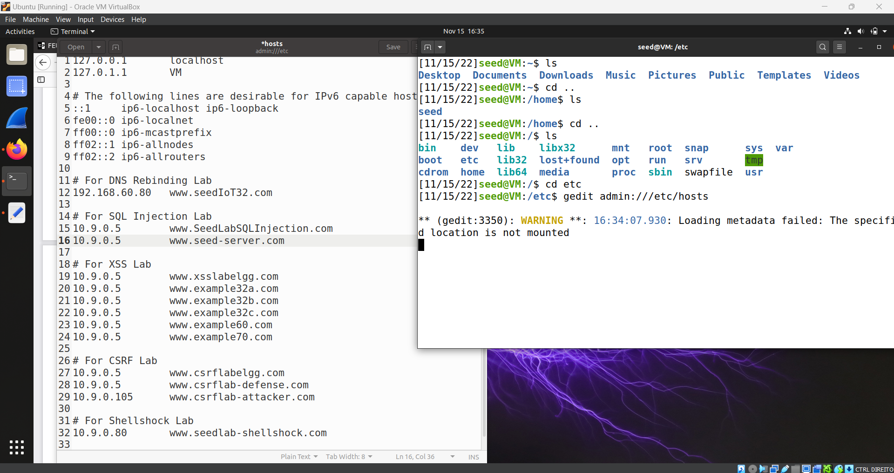

## 2.1 Container Setup and Commands
Depois disso, abrimos dois terminais, nos quais num utilizamos os comandos anteriormente utilizados(dcbuild e dcup), para construir e correr o server.

E no outro terminal executamos os comands dockps para encontrar o container e descobrimos ser o 6c... , logo docksh 6c...

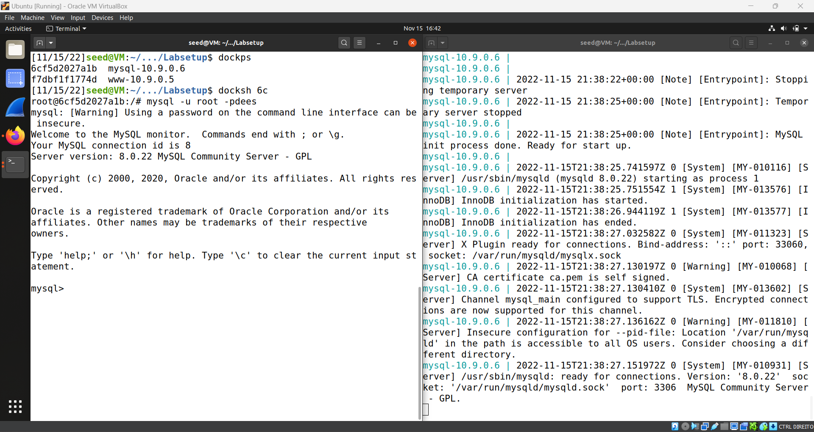

## Task 1: Get Familiar with SQL Statements

O objetivo da primeira tarefa é familiarizar nos com SQL.

Como já estavamos dentro do container, seguimos os passos do guião. Apenas precisamos de fazer login através de "mysql -u root -pdees", em seguida , "use sqllab_users;" e por fim "show tables," para confirmar que tudo correu bem.

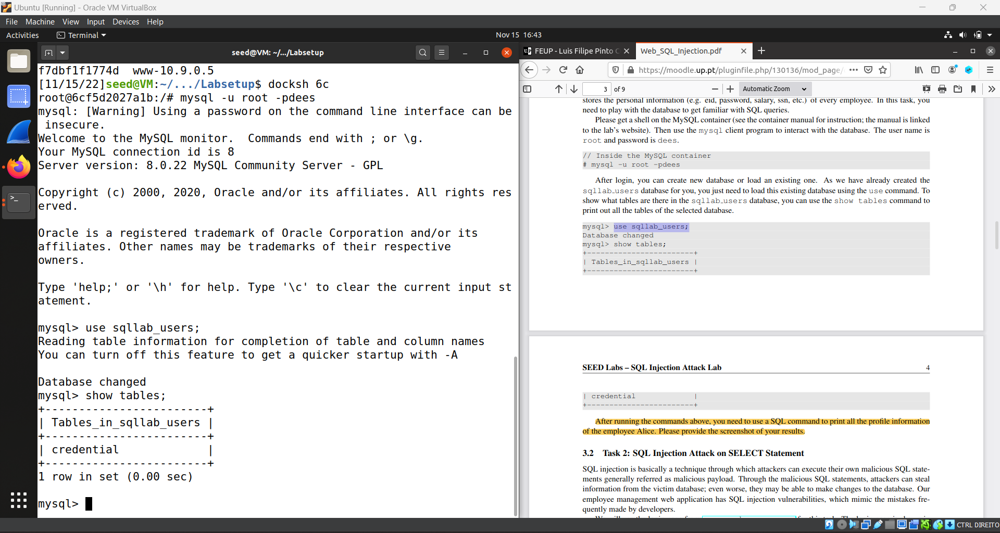

## Task 2: SQL Injection Attack on SELECT Statement

Esta tarefa é para ser utilizada na pagina login do website que estamos a correr no background.

#### 1)  SQL Injection Attack from webpage

O objetivo desta tarefa, é dar login por administrador e ver a informação pretendida.
Sabemos que o nickname do administrador é : admin mas não sabemos a password.

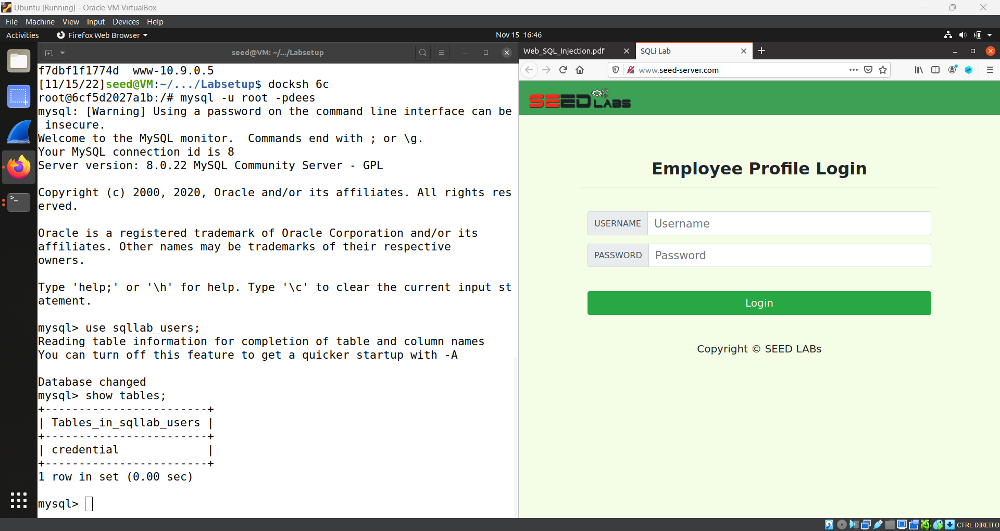

Após alguma pesquisa, descobrimos que utilizando o username : admin'# , sem utilização de uma password, o login era bem sucedido.

Pelo que percebemos se ao username acrescentarmos "'#" conseguimos fazer bypass a certas medidas.

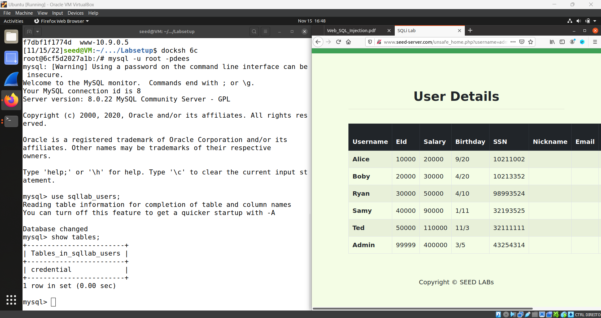

#### 2)  SQL Injection Attack from Command Line

O objetivo desta tarefa é semelhante á anterior, mas desta vez, precisamos de utilizar o comando curl na linha de comandos.

Sabemos que o metodo HTTP é o GET e o formato é  'www.seed-server.com/unsafe_home.php?username=alice&Password=11', logo corremos o seguinte comando  na linha de comandos: curl 'www.seed-server.com/unsafe_home.php?username=alice&Password=11'

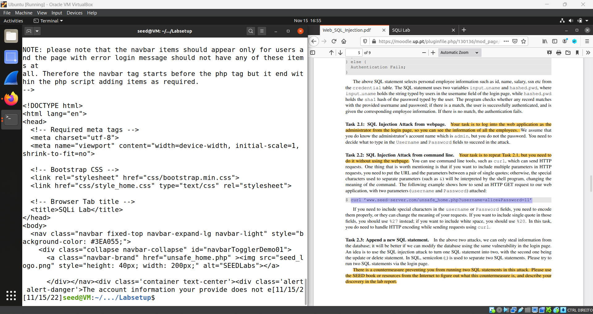

Ao decifrarmos que o administrador teria o url dessa maneira, corremos outro comando :curl 'www.seed-server.com/unsafe_home.php?username=admin%27%20--%20&Password='

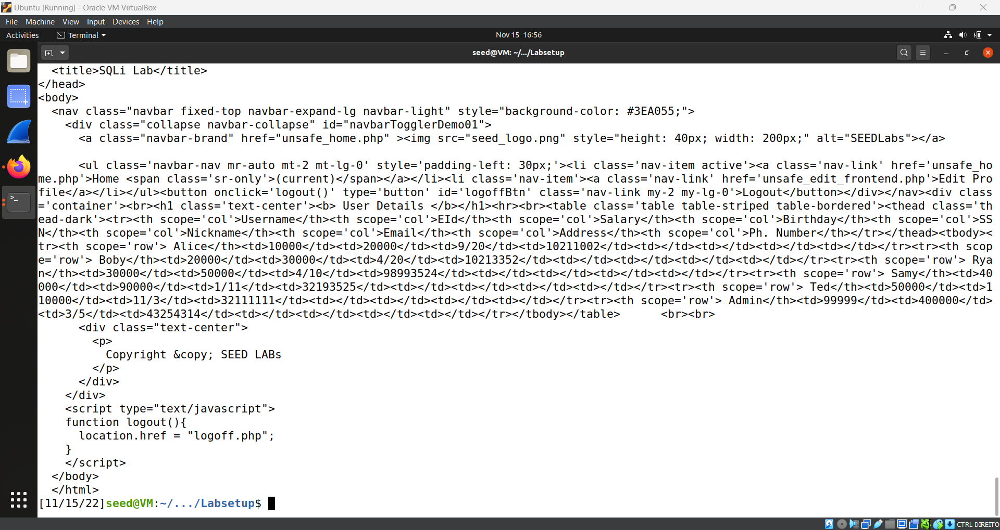

Fizemos copy-past as linhas de codigo html que imprimiu a execução desse comando, e criamos um ficheiro HTML como mostra o anexo seguinte:

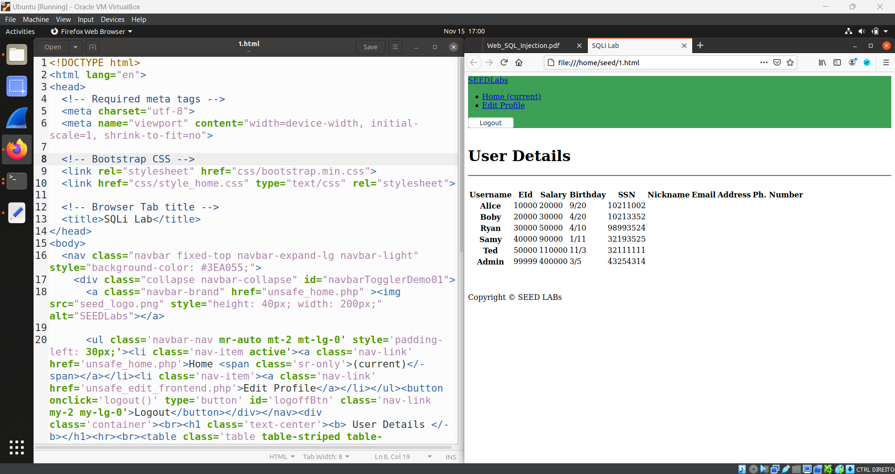

#### 3)  Append a new SQL statement

O objetivo desta tarefa é usar a página de login no browser mais uma vez, mas desta vez, fazer login na conta de Alice e adicionar mais algumas informações.  Desta vez, utilizamos a mesma vulnerabilidade que utilizamos no 2.1 ) "alice'#", mas precisavamos de acrescentar mais algo para poder fazer o tal append.

Utilizamos : "alice'; INSERT INTO credential() VALUES ()" , mas foi sem sucesso.

Após alguma pesquisa, descobrimos que não era possivel, a contramedida é a extensão mysql do PHP (API mysql::query()). O ataque não funcionou porque a API não permite que várias consultas sejam executadas no servidor de banco de dados. 
O que significa, que não é possivel modificar ou acrescentar informação através do metodo append.

## Task 3: SQL Injection Attack on UPDATE Statement

Nesta tarefa vamos utilizar o "Edit Profile Page" do website que estamos a correr em background.

#### 1) Modify your own salary

O objetivo desta tarefa, é modificar o nosso próprio salário, neste caso estamos logados como alice. Para isso, utilizamos a vulnerabilidade anteriormente utilizada, ou seja, nickname: "Alice'#" e Login.

Em seguida vamos ao "Edit Profile Page" e em qualquer um dos campos fizemos o seguinte comando: alice', salary = '350000, o que originou que a Alice, tenha tido um aumento bastante significativo no seu salario.

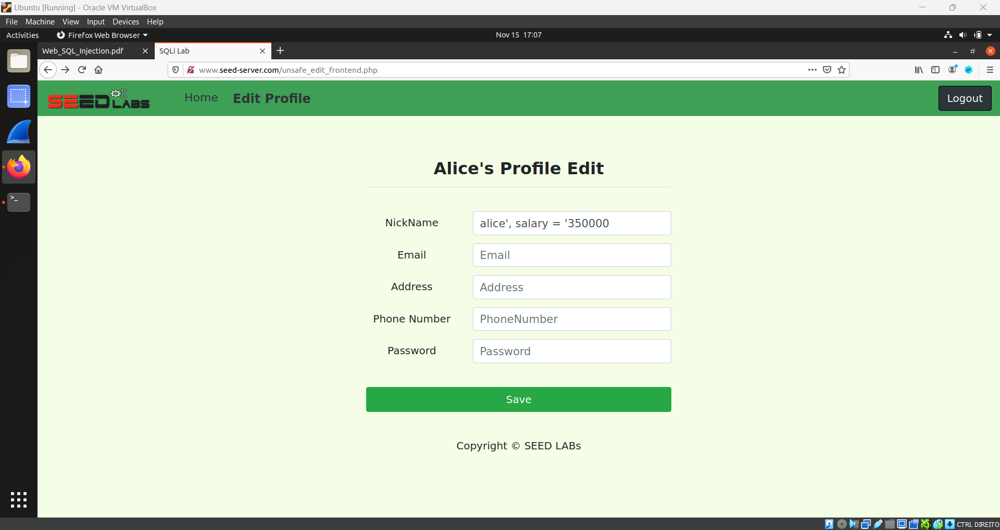

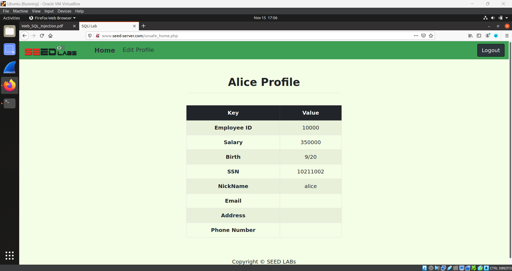

#### 2) Modify other people’ salary.

O objtivo desta tarefa, é modificar o salário de outros elementos, neste caso o Boby para 1.

Para isso utilizamos algo semelhante á tarefa anterior, executamos o seguinte comand : ', salary=1 WHERE Name='Boby';#

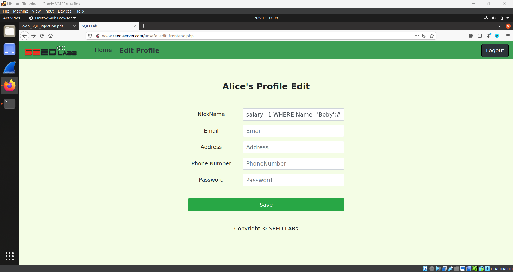

E o resultado foi:

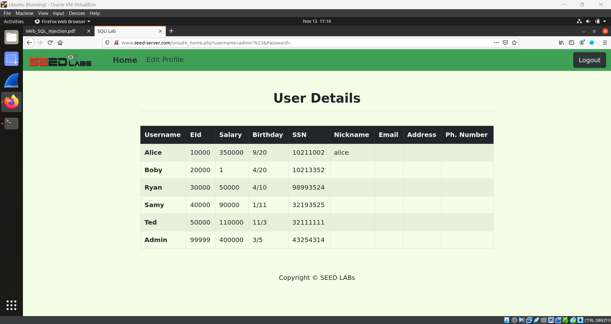

#### 3) Modify other people’ password.

O objetivo desta tarefa é descobrir a password de um elemento e modifica-la, neste caso, o Boby.

Para isso , fomos ao terminal onde tinhamos a base de dados aberta e corremos o seguinte comando: SELECT * from credential;

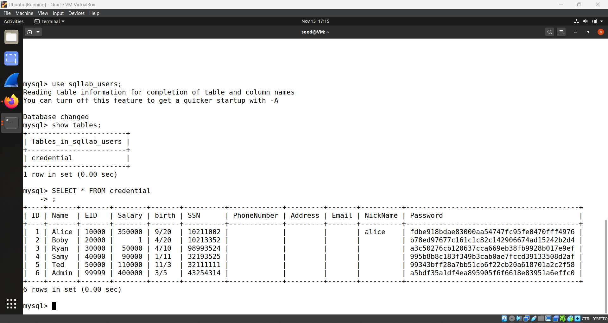

Lá encontramos a passowrd do Boby encriptada, através de SHA1. Procuramos um decoder na internet e o resultado da sua password foi a seguinte:

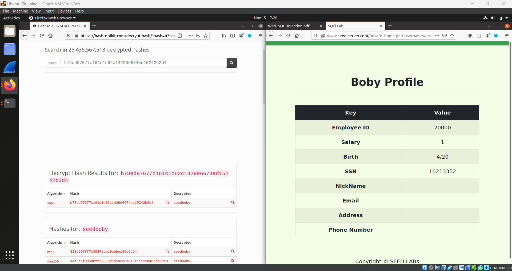

Sendo que o seu login é username : boby e password: seedboby . Em seguida para mudar a sua password, fomos ao "Edit Profile Page" e mudamos a password para "getHacked"

# Desafios CTF

## Desafio 1

A primeira coisa que fizemos foi explorar o código fornecido e identificar como foi feita a consulta para login.

A partir disso, identificamos que poderíamos usar a mesma tática que usamos para fazer login como administrador na task 1. Ao usar "admin';#", também colocamos "#" na senha para garantir.

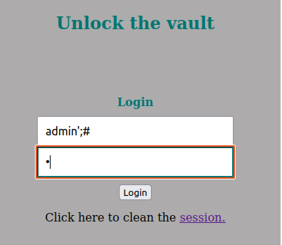

Usando estas credenciais, pudemos fazer login e obter a flag:

## Desafio 2

Depois de olhar o main.c fornecido descobrimos que a vulnerabilidade estava em gets(buffer), já que nos permite escrever fora do suposto local alocado para a variável que está sendo alterada (o que significa que é um buffer overflow attack) .
Usamos um arquivo de exploração em python e com a ajuda do pwn (a mesma ferramenta que usamos em ataques anteriores), conseguimos obter o endereço do buffer (que é vulnerável).

Em seguida, usamos o gdb para analisar o código e descobrimos que o deslocamento necessário para alterar o endereço de retorno era de 108 bytes.
também colocamos shellcode que chama /bin/sh e x90 (que significa avançar).

Aqui está o exploit que usamos:

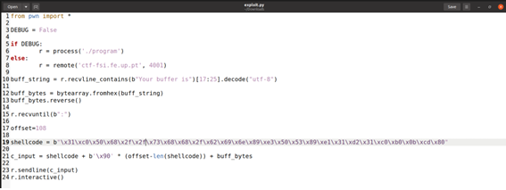

E depois obtivemos a flag:

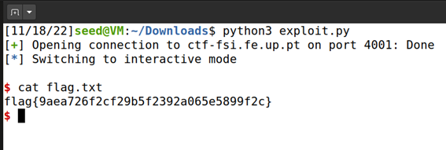
